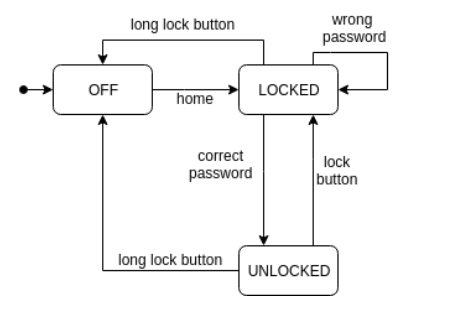
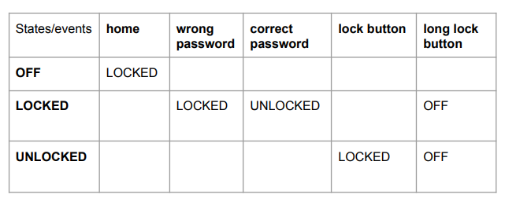
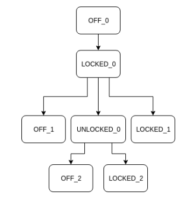
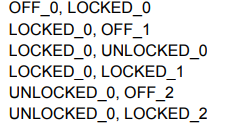
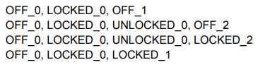

# Postgraduate Program in Information Systems School of Arts, Sciences and Humanities
# University of Sao Paulo
## SIN5022 - Software Test
Prof. Marcelo Medeiros Eler

---
### PROJECT 01 - STATES MACHINES
The objective of this project is to acquire knowledge and skill in
Automatic generation of tests. More specifically, the objective
is to create an automatic test generator using a finite states machine model.

**INPUT:**
- Transition Table (.CSV file)
- Mapping between machine and machine events and actions
events and actions in test code

**PROCESSING:**
1) Read the transition table
2) Generate a transition tree
3) Identify basic paths and secret paths
4) Generate test cases

**OUTPUTS:**
- A state machine representation structure (graph, for example)
- The initial paths of the transition tree
- Scripts with the generated test cases (paths in the tree and
secret paths)

**VALIDATION:**
- CSV files provided with transition tables
- CSV will be provided with mapping between events/actions and files
corresponding code
- For a specific case, you will need ● a program that will respond to the
calls of machine events and actions so that it is possible to execute
the generated tests
#### Example

#### Input
State machine



Transitions Table



#### Output

Transitions tree




Basic paths



--- 
### Execution instructions

**Prerequisites:**
- Golang 1.18.x
- Git installed

**Download the Project**

``` bash
git clone https://github.com/guilhermocc/state-machine-test-generation.git
```

**Setup environment:**
```bash
go mod download
```

**Execute the project using the `device` example**
```bash
go run main.go -t examples/devicestates/input/transition_table.csv -e examples/devicestates/input/events_actions.csv 
```

you should see the following output from in the terminal
```
Generating transitions tree...
Traversing tree to generate basic paths...
Generating test scripts...
```

After that, a `result.md` file will be generated containing the following information:
- **Transitions Tree**
- **Basic Paths**
- **Generated test script**

The generated test script can be copied and pasted in the device example test file (examples/devicestates/device_test.go).

Example:
```go
package devicestates

import (
	"testing"
)

func TestDevice(t *testing.T) {
	// Insert generated test cases below this line
	t.Run("TestPath1", func(t *testing.T) {	
		device := &Device{State: "OFF"}
        assert.Equal(t, "OFF", device.GetState())
        device.Home()
        assert.Equal(t, "LOCKED", device.GetState())
        device.Login("wrong","wrong")
        assert.Equal(t, "LOCKED", device.GetState())
    })
}
```
Then, you can run the tests:
```bash
go test ./examples/devicestates/...
```


